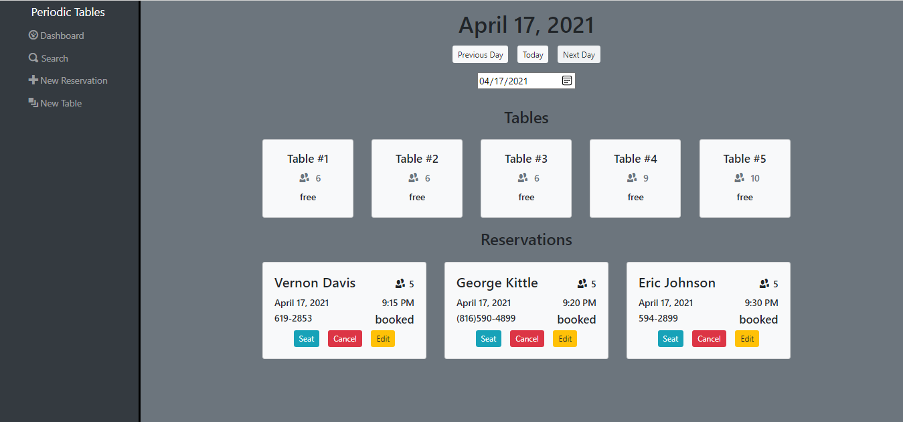
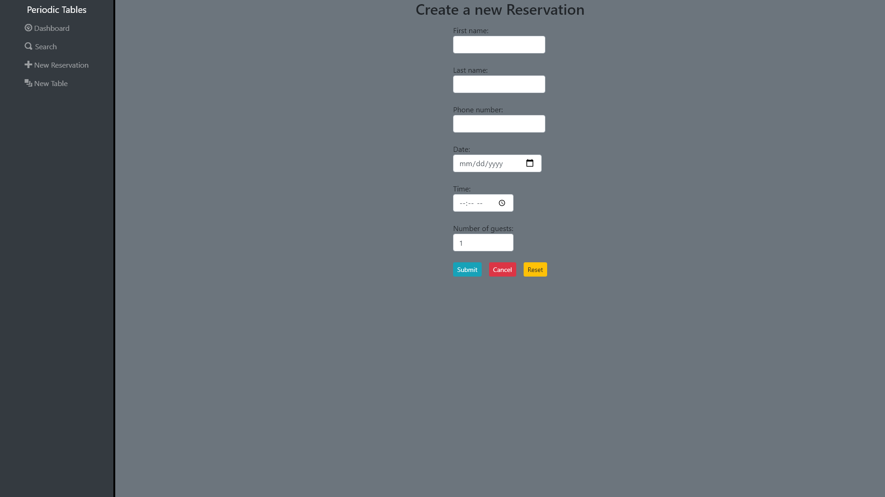

# Thinkful-Final-Capstone: Restaurant Reservation System

## Live Demo
[Restaurant Reservation System](https://restaurants-reservations.vercel.app "Restaurant Reservation System")     

## Project Summary
A Restaurant Reservation System that is used to keep track of guest reservations and table assignments.  
The user can create new reservations and search reservations by phone number.  
and also keep track of where reservations are seated and occupied tables.

### The Dashboard

### Create new Reservation


## Tech Stack
This web app was developed using HTML, CSS, JavaScript, BootStrap, React, Express, Node, PostgreSQL, and Knex.

## API Documentation

| Route       | Method      | Status Code | Description   |
| :---        |    :----:   |     :----:   |        ---:  |
| /reservations      | GET   | 200  | Returns a list of reservations for the current date |
| /reservations?date=####-##-##      | GET |  200    | Returns a list of reservations for the given date |
| /reservations      | POST  | 201    | Creates a new reservation |
| /reservations/:reservation_id      | GET  | 200     | Returns the reservation for the given ID |
| /reservations/:reservation_id      | PUT  | 200     | Updates the reservation for the given ID |
| /reservations/:reservation_id/status      | PUT  | 200     | Updates the status of the reservation for the given ID |
| /tables   | GET  | 200      | Returns a list of tables     |
| /tables   | POST  | 201      | Creates a new table     |
| /tables/:table_id   | GET   |   200   | Returns the table for the given ID     |
| /tables/:table_id/seat   | PUT | 200      | Seats a reservation at the given table_id     |
| /tables/:table_id/seat   | DELETE  | 200      | Changes the occupied status to be unoccupied for the given table_id     |


 ### Reservation JSON Example
 ```json
{
  "reservation_id": 1,
  "first_name": "John",
  "last_name": "Crowder",
  "mobile_number": "530-281-0164",
  "reservation_date": "2021-05-06",
  "reservation_time": "20:00:00",
  "people": 6,
  "status": "booked",
  "created_at": "2020-12-10T08:30:32.326Z",
  "updated_at": "2020-12-10T08:30:32.326Z"
}
```

### Table JSON Example
 ```json
{
  "table_id": 1,
  "table_name": "#1",
  "capacity": 6,
  "occupied": false,
  "reservation_id": null
}
```
## Installation
To install dependencies, use npm install.
```
npm install
```

To start the server and web page, use npm start.
```
npm start
```
Connect to the backend by adding the following to a .env file
```js

// front-end .env example -> Connects to server
REACT_APP_API_BASE_URL=http://localhost:5000
```   
   
Make sure to grab the backend from   
     [Restaurant Reservation System Backend](https://github.com/dstnmyrs99/restaurant-reservation-back "Restaurant Reservation System Backend")